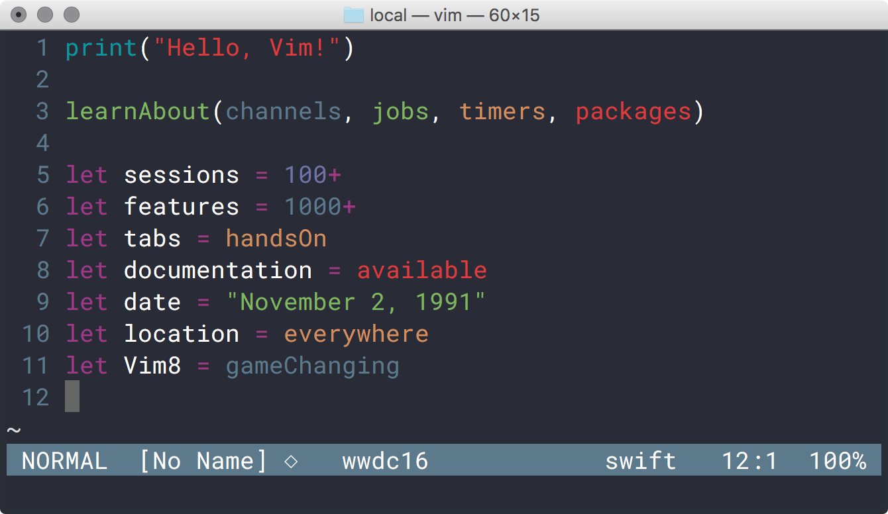

# Vim WWDC16 Color Scheme

This is an experimental dark theme for Vim inspired by the colors
of Apple's upcoming [WWDC16 event](https://developer.apple.com). No,
sorry, font not included :)

Feel free to contribute by modifying/extending the highlight groups. For now,
I have defined a function to simplify the specification of highlight groups.
That is temporary: when the color scheme will get stable, the definitions will
be expanded.

Mandatory picture (might be slightly out of date), taken in Terminal.app using
the Roboto Mono font (Terminal.app profile is included in the plugin):

